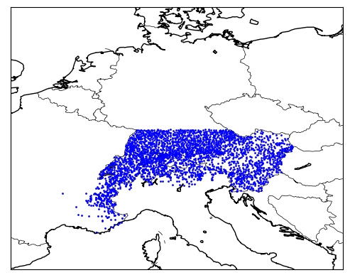
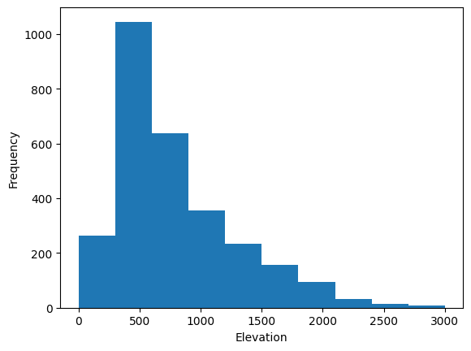
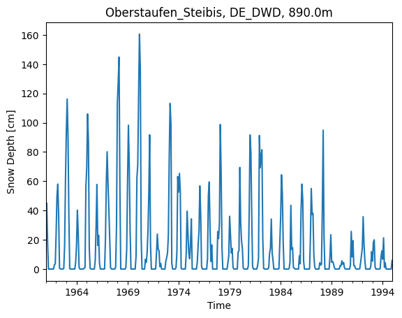
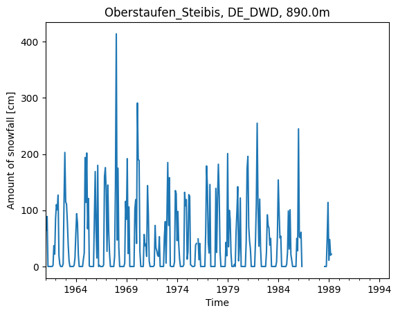

# Project of Data Visualization (COM-480)

| Student's name      | SCIPER |
| ------------------- | ------ |
| Jennifer He         | 366841 |
| David Benedikt Heye | 344184 |
| Simone Roznowicz    | 342864 |

[Milestone 1](#milestone-1-23rd-april-5pm) • [Milestone
2](#milestone-2) • [Milestone 3](#milestone-3)

Unfortunately, our dataset is too large to be uploaded on GitHub.  We
therefore provide it
[here](https://drive.google.com/drive/folders/1dbQMLpdP1ELydWlzE0RpUYygnAP4FNyu).

## Milestone 1 (23rd April, 5pm)

**10% of the final grade**

This is a preliminary milestone to let you set up goals for your final
project and assess the feasibility of your ideas.  Please, fill the
following sections about your project.

*(max. 2000 characters per section)*

### Dataset

For our project, we use the European Alps Snow Depth Observations
dataset available on Kaggle[^1], whose source data is taken from Matiu
et al.[^2].  The dataset contains the monthly snow depth, snow cover
duration, and amount of snowfall at numerous stations in the European
Alps.  Given a large number of stations and a long measurement period
from the 1970s to the 2010s at most stations, the dataset gives
insight into long-term trends.

To our advantage, the dataset contains gap-filled values, i.e. missing
values are, whenever possible, replaced using either measurements from
nearby stations or other information available for the respective
station.

In particular, the dataset comprises the following monthly
information:
- Name – the unique name of a station.
- HNsum – total snow depth in cm.
- HSmean – mean snow depth in cm.
- HSmax – maximum snow depth in cm.
- SCD1gt – duration in days with average daily temperature below 0°C
  while visible or detectable levels of ground cover exist.
- SCDN – duration in days with average daily temperature below 0°C
  with snow depth greater than N cm.
- Gap-filled values – corresponding snow depth value obtained by other
  observations, e.g., HSmean_gapfill gives the mean snow depth
  replaced by similar measurements from other sites.
- Month and year – the time when measurements were taken.

[^1]:
    https://www.kaggle.com/datasets/thedevastator/european-alps-snow-depth-observations
[^2]:
    https://zenodo.org/record/5109574#.ZC_ffXZBy3B

### Problematic

The alpine glaciers are especially vulnerable to rising temperatures
because they present relatively little ice cover.  In such a mountain
range, global warming is further accentuated by what is referred to as
the feedback effect: like a mirror, glaciers reflect solar energy.  If
the surface area of the mirror is reduced, the amount of reflection
also decreases and the sun heats the planet even more.

Therefore, temperatures in the Alps are warming at about 0.3°C per
decade, twice as fast as the global average. Moreover, temperatures
have risen across seasons, precipitation patterns have changed, and
extreme precipitation events have increased in frequency and
severity. According to some 2019 projections[^3], Alpine glaciers will
lose more than 80% of their current mass by 2100 if greenhouse gas
emissions continue to rise.

Our project aims to visualize trends in snow depth and the amount of
snowfall in the European Alps and some close locations over the past
decades. Long-term observations help to examine and associate how
climate change impacts alpine ecosystems in different regions.  Our
data visualization may help researchers determine where amounts of
snow are decreasing to address the problem of less snow to protect the
environment.

By providing interactive visualizations comparing the status quo of
snowfall to that of recent decades, it will hopefully be possible to
highlight the consequences of climate change and global warming.

Therefore, our project has the purpose of providing significant
insights into climate change, not only targeting experts but
especially the broad public.

[^3]:
    https://www.ipcc.ch/srocc/chapter/chapter-2/

### Exploratory Data Analysis

The dataset we are using for our project is generally complete and
clean, reducing the amount of preprocessing and cleaning required by
us.  The data is split into a total of 13 CSV files where one file
holds meta information such as the location and elevation of the
stations.  The other files contain monthly data points holding
information about snow depth and snowfall.  To get an overview of the
data, we merge all data and join them with the meta information on the
station’s names (which is unique).  This gives us measurement data for
a total of 2840 stations, as seen in the figure below, with a total of
1,519,452 unique snow depth measurements.

| Country     | Number of stations |
|-------------|--------------------|
| Austria     | 653                |
| Switzerland | 599                |
| Germany     | 965                |
| France      | 267                |
| Italy       | 178                |
| Slovenia    | 178                |

The elevations of the stations range from 2m to 3000m above sea level.
The average altitude is about 800m with 75% of the stations located
below an altitude of 1040m.  The figure below shows a histogram of the
elevation of all stations.

By randomly choosing a station from our dataset, we are already able
to see that the average monthly snow depth is slowly decreasing over
the years.

Moreover, the dataset provides data indicating the total amount of
snowfall per month.  A plot of these data shows that more snowfall
does not necessarily imply more snow depth (most snowfall in 1968,
largest snow depth in 1971).

Unfortunately, the gap-filled data is not complete for all stations.
For example, in Bellecote Nivose (the station with the highest altitude in the
dataset), the observations are not complete until 2005, as seen below.
In this case, we expect to either find a way to add meaningfully
interpolated values for our visualization or ignore years with
incomplete data.

As the dataset does not provide data over the same measurement period
for all stations, we will consider a common arbitrary period when
comparing different stations.  If only a few data points are missing,
we could mark them separately and thus compare larger time periods.

### Related work

Matiu et al.[^4] analyzed snow depth trends in the European Alps from
1971 to 2019 using the aforementioned dataset.  They identified five
distinct snow regions and found that the average seasonal,
i.e. November to May, snow depth is decreasing by 8.4% per decade, and
the maximum snow depth is decreasing by 5.6% per decade.  The authors
have preprocessed the dataset, adding the gap-filled values to perform
their analysis.

Matiu et al. use simple data visualizations such as scatter and line
plots to show the snow depth for each region.  Hence, our goal is to
enhance their analysis through advanced visualizations to allow
further explorations of the alpine-wide data. We aim to provide
insights into trends of and between arbitrary weather stations to
promote the findings.

As a source of inspiration for our visualization, we use a
visualization by Reuters[^5] showing gas storage fill levels in
Europe.  We believe that this type of visualization could be used to
show the snow depth measured at a specific station over the course of
one year.  By animating the plot, we could also show more than one
year by overlapping lines (one revolution is still one year).

Furthermore we take inspiration from the picture below[^6].  A 3D
topographic map could allow us to show exactly where the stations in
the dataset are located along with their altitude.

[^4]:
    https://tc.copernicus.org/articles/15/1343/2021/
[^5]:
    https://www.reuters.com/graphics/UKRAINE-CRISIS/EUROPE-GAS/zdvxozxzopx/
[^6]:
    https://gruasyaparejos.com/en/topography/topographic-map-definition/

## Milestone 2 (7th May, 5pm)

**10% of the final grade**

## Milestone 3 (4th June, 5pm)

**80% of the final grade**

## Late policy

- < 24h: 80% of the grade for the milestone
- < 48h: 70% of the grade for the milestone
